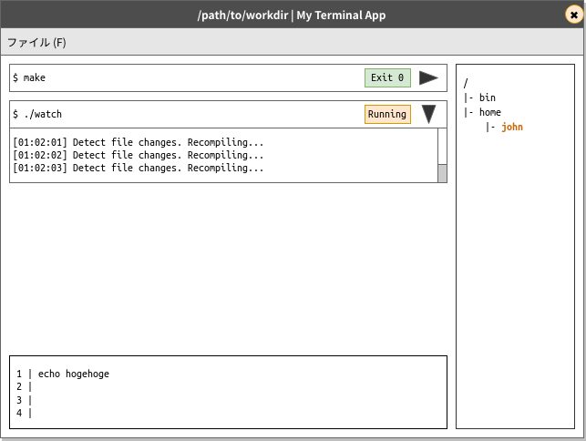

# Reterm (仮)

IDE っぽい UI のターミナルエミュレータ。(Electron + React + TypeScript)

ステータス: ほとんど未実装

## 機能

- コマンドの入力・編集を普通のエディタと同様に行える
- ジョブごとに独立して入力操作や出力の閲覧を行える
- 作業ディレクトリなどをファイラのようにツリーで視覚的にみれる

## UI (予定)

イメージ図:

- ファイルツリー
    - ファイルやディレクトリのツリーが表示される
    - 作業ディレクトリは強調表示される
    - ディレクトリをダブルクリックして作業ディレクトリを変更できる
    - 選択しているファイルのパスをシェルの変数として参照できる
- エディタ
    - monaco-editor の予定
    - 構文強調や入力補完が動く (予定)
    - Ctrl+Enter でジョブを実行する
    - Ctrl+↑/↓ で履歴にあるコマンドを使う
- ジョブリスト
    - ジョブごとにカードが表示される
    - カードはヘッダー部分とボディーからなる
    - ヘッダーをクリックするとボディ部分を折りたんで隠せる
    - ヘッダーにジョブのコマンドとステータスが表示される (実行中か否か。終了済みなら終了コードも。)
    - ボディ部分に出力が表示される
    - ジョブにフォーカスを当てた状態でのキーボード操作は、このジョブに対して処理される
        - カーソルキーなど
    - (イメージには描かれていないが、おそらく read line に応答するための入力欄がある)
    - (イメージには描かれていないが、おそらく SIGINT を送るための ✖ ボタンがある)
    - (おそらく検索機能とかもあった方がよい)

### その他

- Git との統合
    - ファイルの状態や、ブランチやスタッシュの表示など

## 類似プロジェクト?

(他に知っていたら教えてください。)

- [railsware/upterm\: A terminal emulator for the 21st century.](https://github.com/railsware/upterm) (archived)

## 開発用の資料

- [electron docs](https://www.electronjs.org/docs) Electron のドキュメント
- [electron/electron-quick-start-typescript\: Clone to try a simple Electron app (in TypeScript)](https://github.com/electron/electron-quick-start-typescript) リポジトリの土台になっているやつ
- [microsoft/node-pty\: Fork pseudoterminals in Node.JS](https://github.com/microsoft/node-pty) プロセスを起動するやつ (`child_process` と違って、起動したプロセスにはターミナルから直接呼ばれたようにみえる)
